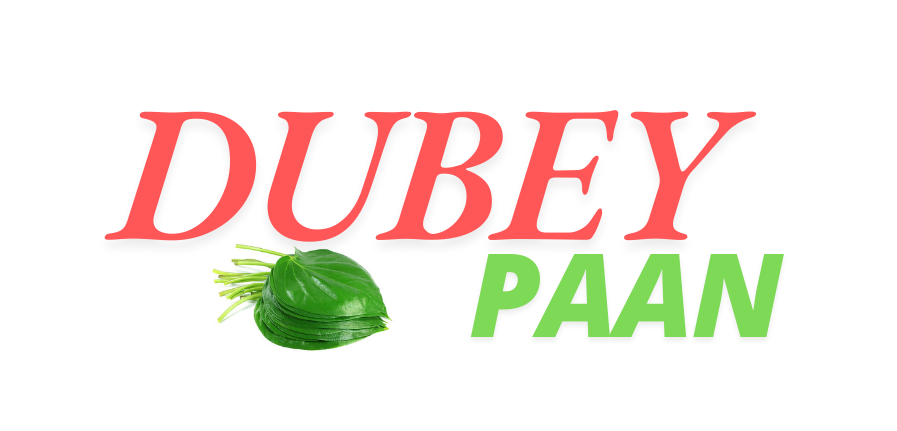
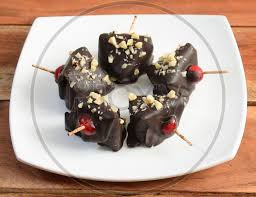

# DubbeyPaan.github.io
DubeyPaanVesu/imagesss/1-removebg-preview (1).png
DubeyPaanVesu/imagesss/1-removebg-preview (1).png
DubeyPaanVesu/imagesss/DubeyPaanImage.png
DubeyPaanVesu/imagesss/Super chocolate pan.jpeg
DubeyPaanVesu/imagesss/download (1).jpeg
DubeyPaanVesu/imagesss/MAGHAI MEETHA PAN.jpeg
DubeyPaanVesu/imagesss/images.jpeg
DubeyPaanVesu/imagesss/Shahi  pan.jpeg
DubeyPaanVesu/imagesss/Gundi pan3.jpeg
DubeyPaanVesu/imagesss/333994347_732875088496620_8971074184401928432_n.jpg
DubeyPaanVesu/imagesss/1-removebg-preview (1).png
<!DOCTYPE html>
<html lang="en">
<head>
    <meta charset="UTF-8">
    <meta name="viewport" content="width=device-width, initial-scale=1.0">
    <link href="https://fonts.googleapis.com/css?family=Poppins:100,100italic,200,200italic,300,300italic,regular,italic,500,500italic,600,600italic,700,700italic,800,800italic,900,900italic" rel="stylesheet" />
    <title>Dubey Paan</title>
    
    <link rel="stylesheet" href="https://cdnjs.cloudflare.com/ajax/libs/font-awesome/6.0.0-beta3/css/all.min.css">
<!--     <link rel="stylesheet" href="style.css"> -->
  
</head>
<body>
   

      <!-- agar ham parent ke upper -> overflow hidden laga dete hai to  
        chlid ha 
        position:sticky
        ya 
        position:absolute kaam nnhai karta
        . is liya hamko 
        height:100vh lagana padega -->

   <header>
      <!--  -->
   <!-- 
 -->
      

   <!-- </header> -->
    

        
    

    
     <!--  RAKHNE Ko to ham div me bhi rakh sakte hai navigational bar
        par ham sematic tag ka use kar ke responsive website banaye ge -->
        <!-- is liye we use nav bar -->
        

         

            
               &#9776; <!-- three dought wala image ka code hai-->
             
         

         

         <nav>
             <strong >&times;close icon</strong><!--&times;cross ka icon hai-->
            <!-- jab phone device me convert ho ga tab x cross wala icon tick hoga -->
            <!-- <nav class="nav"></nav> -->
            <!-- using ul & li -->
             <!-- par a ancher tag ka hi use kar sakte hai -->
            <a href="#Top-Picks">MAGHAI MEETHA PAN</a>
            <a href="#Whopper">Chocolate pan</a>
            <a href="#Stunner-Menu">Super chocolate pan</a>
            <a href="#New-Foodie-Collection">Shahi  pan</a>
            <a href="#Deal-of-the-Day">Gundi pan</a>
            <a href="#About Us">About Us</a>
         </nav>
         <!-- 

         

            
                &#9776; three dought wala image ka code hai
             
         

         
 --> 
         

   </header> 
   <main>
      
      <section class="hero-section">
         <!-- 

            
         
 -->
         <!-- add sliding imagess -->
          

         

            

                
                
                
            

            <button class="prev" onclick="moveSlide(-1)">&#10094;</button>
            <button class="next" onclick="moveSlide(1)">&#10095;</button>
        

        

        <!-- 
Well, You can,t resist anymore!
  -->
         
""Wellcome to <STROng> Dubey Paan</STROng>""

      </section>
      
      <section id="Top-Picks" class="section">
         <h2>MAGHAI MEETHA PAN   ₹ = 55         </h2>
         

            
         

         
      </section>
      <section id="Whopper" class="section">
         <h2>Chocolate pan ₹ = 50</h2>
         

            
         

         
      </section>
      <section id="Stunner-Menu" class="section">
         <h2>Super chocolate pan ₹ = 50 </h2>
         

            
         

         
      </section>
      <section id="New-Foodie-Collection" class="section">
         <h2>Shahi  pan ₹ = 40 </h2>
         

            
         

         
      </section>
      <section id="Deal-of-the-Day " class="section">
         <h2>Gundi pan ₹ = 35    </h2>
         

            
         

         
      </section>
      <footer id="About Us">
      <h3 class="go-to-top"><a href="#logo">Go to top</a></h3>
      <!-- ----------------------------------------------------------------- -->
      <!-- added extra about us feature in dubey Paan website -->
       <!-- ---------------------------------------------------------------- -->
      

          

            <h2>
               About Us
            </h2>
            
            

               <!-- <ul>
                  <li>Passion for Paan: Our young entrepreneur is passionate about crafting unique flavors that reflect both tradition and innovation.</li>
                  <li>Fresh Ingredients: We source only the freshest ingredients to ensure each bite is a burst of flavor.</li>
                  <li>Community Focused: We believe in supporting our local community and contributing to its vibrancy through our small business.</li>
                  <li>Customer-Centric: Your satisfaction is our priority! We welcome feedback and are always looking to improve.</li>
                  <li>Thank You for Your Support: Every purchase helps fuel young entrepreneurship and inspires creativity.</li>
               </ul> -->
               
Welcome to <strong>Dubey Paan</strong>, a paan shop run by a creative 13-year-old! We offer a variety of delicious paan flavors made with love and fresh ingredients. Thank you for supporting young entrepreneurship!  
                  <!-- <ul>
                     <li>Passion for Paan: Our young entrepreneur is passionate about crafting unique flavors that reflect both tradition and innovation.</li>
                     <li>Fresh Ingredients: We source only the freshest ingredients to ensure each bite is a burst of flavor.</li>
                     <li>Community Focused: We believe in supporting our local community and contributing to its vibrancy through our small business.</li>
                     <li>Customer-Centric: Your satisfaction is our priority! We welcome feedback and are always looking to improve.</li>
                     <li>Thank You for Your Support: Every purchase helps fuel young entrepreneurship and inspires creativity.</li>
                  </ul> -->
                  
                  
                  
                  
               

               <section>
               <ul style="color: darkolivegreen;">
                  <h3 style="color: rgb(241, 243, 237) ;">Delicious paan flavors</h3>
                   <!-- <li>Classic Mint Pan</li>
                   <li>Sweet Coconut Pan</li>
                   <li>Spicy Masala Pan</li>
                   <li>Fruity Surprise Pan</li> -->
                   <li>Chocolate bomb ₹ 35 </li>
                  <li>Super sada ₹ 40</li>
                  <li>Chocolate pan ₹ 50
                  </li>
                  <li>MAGHAI MEETHA PAN ₹ 55
                  </li>
                  <li>MAGHAI chocolate pan ₹ 60
                  </li>
                  <li>Kalkatta Sada pan ₹ 35
                  </li>
                  <li>Meetha pan ₹ 45
                  </li>
                  <li>Shahi  pan ₹ 45
                  </li>
                  <li>Gundi pan ₹ 35

                  </li>
                  <li>Banarasi meetha pan ₹ 35
                  </li>
                  <li>Banarasi sada pan ₹ 30
                  </li>
                  <li>Tulsi 00 pan ₹ 30</li>
                  <li>Navratna chatni sada pan ₹ 40
                  </li>
                  <li>Navratna quiwam 90 no pan ₹ 65 </li>
                  <li>Super chocolate pan ₹ 55
                  </li>
                  <li>Baba 120 pan ₹ 30
                  </li>
                  <li>Chocolaty 120 pan ₹ 35
                  </li>
                  <li>Super sada ₹ 40</li>
               </ul>
               </section>
               <!-- 

               

 -->
                <!--
                    <h3>Delicious Paan Flavors </h3>
                  <li>Chocolate bomb ₹ 35 </li>
                  <li>Super sada ₹ 40</li>
                  <li>Chocolate pan ₹ 50
                  </li>
                  <li>MAGHAI MEETHA PAN ₹ 55
                  </li>
                  <li>MAGHAI chocolate pan ₹ 60
                  </li>
                  <li>Kalkatta Sada pan ₹ 35
                  </li>
                  <li>Meetha pan ₹ 45
                  </li>
                  <li>Shahi  pan ₹ 45
                  </li>
                  <li>Gundi pan ₹ 35

                  </li>
                  <li>Banarasi meetha pan ₹ 35
                  </li>
                  <li>Banarasi sada pan ₹ 30
                  </li>
                  <li>Tulsi 00 pan ₹ 30</li>
                  <li>Navratna chatni sada pan ₹ 40
                  </li>
                  <li>Navratna quiwam 90 no pan ₹ 65 </li>
                  <li>Super chocolate pan ₹ 55
                  </li>
                  <li>Baba 120 pan ₹ 30
                  </li>
                  <li>Chocolaty 120 pan ₹ 35
                  </li>
                  <li>Super sada ₹ 40</li>
              
                
 
            

         </li> -->
               
               
           
            

            <!-- 
Welcome to <strong>Dubey Paan</strong>, a paan shop run by a creative 13-year-old! We offer a variety of delicious pan flavors made with love and fresh ingredients. Thank you for supporting young entrepreneurship!
 -->
            <!-- 
Contact Number: <a href="tel:+1234567890">+91 8511333600</a>
 -->
          

         <!-- 
Contact Number: <a href="tel:+1234567890">+91 8511333600</a>
 -->
         

            <h2>Contact Us</h2>
            <!-- 
Contact Number: <a href="tel:+1234567890">+91 8511333600</a>
 -->
             <a href="tel:+8511333600">+91 8511333600
               <i class="fa fa-phone" style="font-size:30px;color:rgb(21, 130, 58)"></i>
             </a>
             <a href="https://www.facebook.com/p/Dubey-pan-Vesu-100063941534085/" target="_blank">
                 <i class="fab fa-facebook-f" style="font-size:30px;color:rgb(59, 99, 234)"></i> Facebook
             </a>
             <a href="https://www.instagram.com/dubey_paan/" target="_blank">
                 <i class="fab fa-instagram" style="font-size:30px;color:red"></i> Instagram
             </a>
         

     

     <!-- ---------------------------------------------------------------------- -->
      
  Made with ❤️ by Harshit dubey   ""The website is currently in the development phase.""

      </footer>
      <!-- by defualt # lagane se top pe hi chala jata hai  -->
   </main>

<!-- <h2>HARSHIT DUBEY</h2> -->

</body>
</html>
